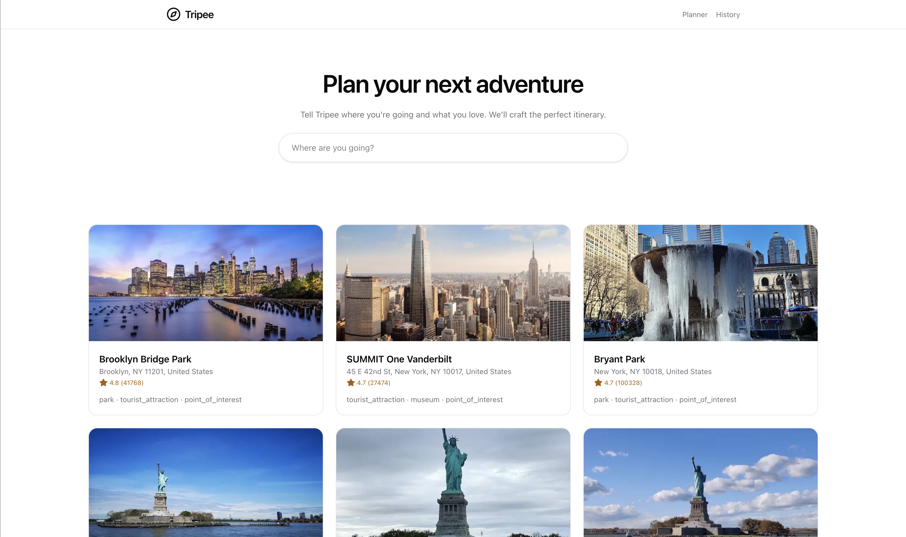
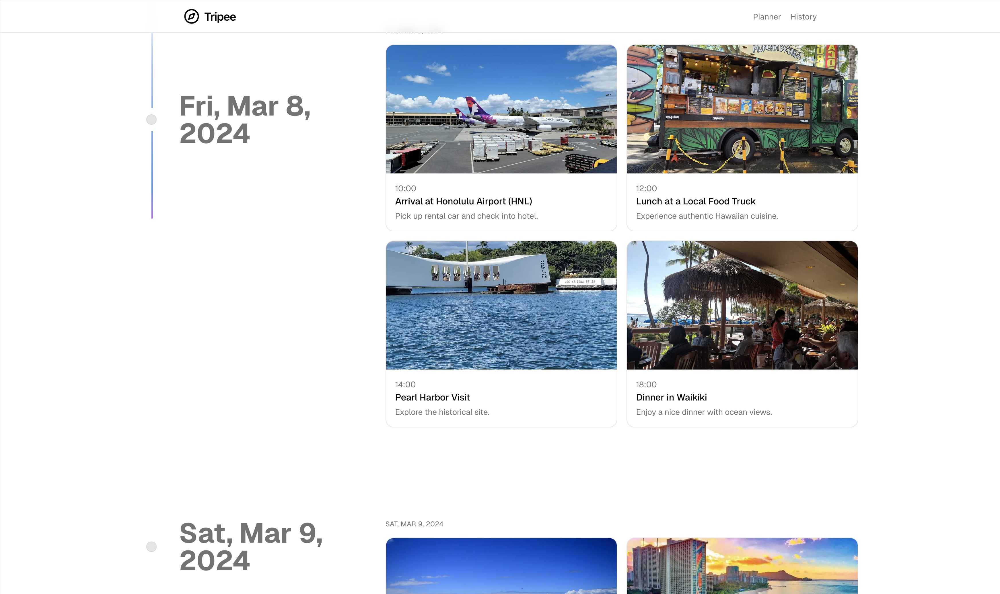

### Tripee – AI-assisted itinerary planner




Plan smarter trips with AI: generate daily timelines, browse places with photos/reviews, and visualize routes on maps.

### Quick start

1) Install dependencies

```
pnpm install
```

2) Configure environment

Create `.env.local` with at least:

```
NEXT_PUBLIC_GOOGLE_MAPS_API_KEY=...
NEXT_PUBLIC_GEMINI_API_KEY=...
NEXT_PUBLIC_MONGODB_URI=...
NEXT_PUBLIC_MONGODB_DB=smart-travel-itineraries
```

3) Run the app

```
pnpm dev
```

Visit http://localhost:3000.

### Documentation

Start here: [`docs/README_DOCS.md`](docs/README_DOCS.md)

- Setup & deployment: [`docs/SETUP.md`](docs/SETUP.md)
- Architecture & data models: [`docs/ARCHITECTURE.md`](docs/ARCHITECTURE.md)
- Components reference: [`docs/COMPONENTS.md`](docs/COMPONENTS.md)
- API reference: [`docs/API.md`](docs/API.md)
- State management: [`docs/STATE.md`](docs/STATE.md)
- Usage guide: [`docs/USAGE.md`](docs/USAGE.md)
- Security & privacy: [`docs/SECURITY_PRIVACY.md`](docs/SECURITY_PRIVACY.md)
- Phase 1 progress report: [`docs/PROGRESS_REPORT_PHASE_1.md`](docs/PROGRESS_REPORT_PHASE_1.md)

### Tech stack

- Next.js 15, React 19, TypeScript
- Tailwind CSS v4
- Zustand (client state), SWR (data fetching)
- MongoDB (plans persistence)
- Google Gemini (itinerary generation)
- Google Maps/Places (maps, places, photos)

### Scripts

- `pnpm dev` – run locally (Turbopack)
- `pnpm build` – production build
- `pnpm start` – start production
- `pnpm lint` – run ESLint
- `pnpm format` – format with Prettier

